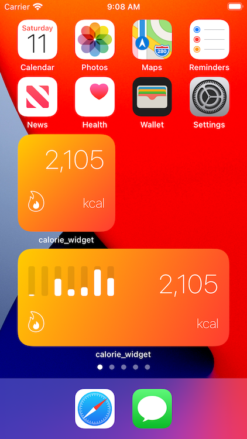

# Calorie widget

The Apple Health app only shows you your active and resting calories for the day as individual metrics. The aim of this widget is to display the total combined calories burned today as a single number on the home screen.

Home screen widgets will be released with iOS 14, and this seems to be a good project to learn Swift.

Example screenshot:

## TODO: 

* Create medium sized widget including graph of calories burned over last 7 days
* Make widget configurable, with option to show "net" calories (when including dietary calories)

## License

This project is licensed under the MIT License - see the [LICENSE.md](LICENSE.md) file for details

## Acknowledgments

* Invaluable insight into how to create a widget gleaned from this [SwiftRocks tutorial](https://swiftrocks.com/ios-14-widget-tutorial-mini-apps)
* [StackoverFlow answer](https://stackoverflow.com/a/40626985/9961901) explaining how to query HealthKit for daily totals of metrics
* More learning about HealthKit from [here](https://gitlab.com/agostini.tech/ATHealthKit) and [here](https://www.raywenderlich.com/459-healthkit-tutorial-with-swift-getting-started)
* [This example](https://developer.apple.com/documentation/healthkit/workouts_and_activity_rings/speedysloth_creating_a_workout) from the Apple Developer documentation